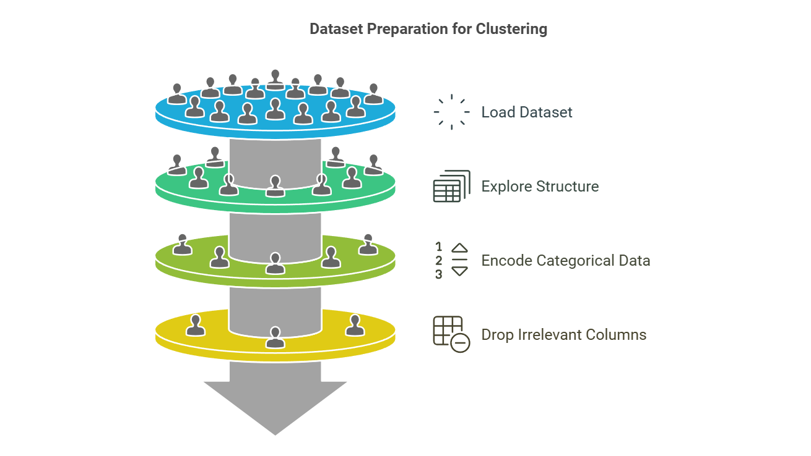

---
jupyter:
  kernelspec:
    display_name: Python 3 (ipykernel)
    language: python
    name: python3
  language_info:
    codemirror_mode:
      name: ipython
      version: 3
    file_extension: .py
    mimetype: text/x-python
    name: python
    nbconvert_exporter: python
    pygments_lexer: ipython3
    version: 3.12.7
  nbformat: 4
  nbformat_minor: 5
  papermill:
    default_parameters: {}
    duration: 16.145439
    end_time: "2023-02-03T19:51:07.379403"
    environment_variables: {}
    input_path: \_\_notebook\_\_.ipynb
    output_path: \_\_notebook\_\_.ipynb
    parameters: {}
    start_time: "2023-02-03T19:50:51.233964"
    version: 2.3.4
---
# Customer Segmentation Using K-Means and DBSCAN Clustering


This project focuses on customer segmentation using the K-Means
clustering algorithm. By analyzing a dataset of mall customers, we aim
to identify distinct groups based on their demographics and spending
behaviors. The project includes the following steps:

-   Data Preparation: Load and preprocess the dataset to ensure it is
    clean and suitable for clustering analysis.
-   Exploratory Data Analysis (EDA): Visualize key features to uncover
    patterns and relationships within the data.
-   Feature Engineering: Normalize the dataset and select relevant
    features for effective clustering.
-   Clustering: Implement both K-Means and DBSCAN clustering algorithms
    to segment the customers. For K-Means, determine the optimal number
    of clusters using the Elbow Method. For DBSCAN, explore the effect
    of different parameters like epsilon and min_samples.
-   Evaluation: Evaluate the performance and quality of the clusters
    using metrics such as Silhouette Score and Davies-Bouldin Index.

The results from both algorithms provide valuable insights into customer
behavior, enabling businesses to optimize their marketing approaches and
enhance customer engagement. \_\_\_

## Types Clustering:


### Connectivity-based clustering

-   Distance based
-   E.g., Hierarchical clustering

### Centroid-based clustering

-   Represents each cluster by a single mean vector
-   E.g., k-means algoritm

### Distribution-based clustering

-   Modeled using statistical distributions
-   E.g., Multivariate normal distributions used by the
    expectation-maximization algorithm.

### Density-based clustering

-   Defines clusters as connected dense regions in the data space.
-   E.g., DBSCAN
:::

::: {#099986f4 .cell .markdown papermill="{\"duration\":1.1139e-2,\"end_time\":\"2023-02-03T19:50:59.221168\",\"exception\":false,\"start_time\":\"2023-02-03T19:50:59.210029\",\"status\":\"completed\"}" tags="[]"}

------------------------------------------------------------------------

# I: Import Required Libraries

In this step, we import essential libraries for:

-   Data manipulation and analysis
-   Visualization
-   Implementing the k-means and DBSCAN clustering algorithm
    Additionally, we configure our Jupyter Notebook for inline plotting.
:::

::: {#c060ca0f .cell .code execution_count="2" papermill="{\"duration\":1.363486,\"end_time\":\"2023-02-03T19:51:00.595768\",\"exception\":false,\"start_time\":\"2023-02-03T19:50:59.232282\",\"status\":\"completed\"}" tags="[]"}
``` python
# 1. Setting Environment Variables (Optional)
import os
os.environ["OMP_NUM_THREADS"] = "1"  # Restrict OpenMP to use a single thread to avoid resource overuse (if needed)

# 2. Libraries for Data Manipulation and Analysis
import pandas as pd  # For handling and processing tabular data (e.g., datasets, dataframes)
import numpy as np   # For numerical computations and array handling

# 3. Libraries for Data Visualization
import seaborn as sns  # For advanced and aesthetic statistical visualizations
import matplotlib.pyplot as plt  # For basic plotting and graph customization

# 4. Libraries for Clustering and Evaluation
from sklearn.cluster import KMeans  # K-Means algorithm for clustering data
from sklearn.preprocessing import StandardScaler  # For scaling data to standardize feature values
from sklearn.decomposition import PCA  # For reducing data dimensions before clustering (if needed)
from sklearn.metrics import silhouette_score, davies_bouldin_score  # For evaluating clustering quality

# 5. Additional Libraries for Enhancements
from matplotlib.patches import Ellipse  # To add ellipses in plots (e.g., visualizing cluster boundaries)
import warnings
warnings.filterwarnings('ignore')  # Suppress warnings for cleaner output
from scipy import stats  # For additional statistical computations (if required)
from yellowbrick.cluster import SilhouetteVisualizer  # For visualizing silhouette scores of clustering models

# 6. Configure Inline Plotting (Specific to Jupyter Notebooks)
# Ensures that visualizations are displayed directly within the notebook interface
%matplotlib inline  

# 7. Setting Default Styles for Visualizations
sns.set_style('whitegrid')  # Apply a clean "whitegrid" style to seaborn visualizations
plt.style.use('fivethirtyeight')  # Use the "fivethirtyeight" theme for matplotlib plots to enhance appearance

# 8. Print Confirmation Message
print("------ All Packages are installed and ready! ------")
```

::: {.output .stream .stdout}
    ------ All Packages are installed and ready! ------
:::
:::

::: {#f4786588 .cell .markdown papermill="{\"duration\":1.0915e-2,\"end_time\":\"2023-02-03T19:51:00.618121\",\"exception\":false,\"start_time\":\"2023-02-03T19:51:00.607206\",\"status\":\"completed\"}" tags="[]"}

------------------------------------------------------------------------

# II: Load and Preprocess the Dataset



In this step, we:

1.  Load the dataset.
2.  Explore its structure and basic statistics.
3.  Handle categorical data by encoding the \'Genre\' column.
4.  Drop irrelevant columns for clustering (e.g., \'CustomerID\').
:::

::: {#fec026dd-aec1-4dd1-8580-0d511a7198ff .cell .markdown}
## Load the dataset
:::

::: {#1cfb95a1 .cell .code execution_count="4" papermill="{\"duration\":5.9315e-2,\"end_time\":\"2023-02-03T19:51:00.688797\",\"exception\":false,\"start_time\":\"2023-02-03T19:51:00.629482\",\"status\":\"completed\"}" tags="[]"}
``` python
data = pd.read_csv("Mall_Customers.csv")
```
:::

::: {#eac9815d-7898-4035-a99e-e409c43d8fdc .cell .markdown}
## Display the first five rows of the dataset to understand its structure
:::

::: {#edc634c0-3187-4c87-8d1b-50db95f94b22 .cell .code execution_count="6"}
``` python
print("----- Displaying the first few rows of the dataset -----")
display(data.head())
```

::: {.output .stream .stdout}
    ----- Displaying the first few rows of the dataset -----
:::

::: {.output .display_data}
```{=html}
<div>
<style scoped>
    .dataframe tbody tr th:only-of-type {
        vertical-align: middle;
    }

    .dataframe tbody tr th {
        vertical-align: top;
    }

    .dataframe thead th {
        text-align: right;
    }
</style>
<table border="1" class="dataframe">
  <thead>
    <tr style="text-align: right;">
      <th></th>
      <th>CustomerID</th>
      <th>Genre</th>
      <th>Age</th>
      <th>Annual Income (k$)</th>
      <th>Spending Score (1-100)</th>
    </tr>
  </thead>
  <tbody>
    <tr>
      <th>0</th>
      <td>1</td>
      <td>Male</td>
      <td>19</td>
      <td>15</td>
      <td>39</td>
    </tr>
    <tr>
      <th>1</th>
      <td>2</td>
      <td>Male</td>
      <td>21</td>
      <td>15</td>
      <td>81</td>
    </tr>
    <tr>
      <th>2</th>
      <td>3</td>
      <td>Female</td>
      <td>20</td>
      <td>16</td>
      <td>6</td>
    </tr>
    <tr>
      <th>3</th>
      <td>4</td>
      <td>Female</td>
      <td>23</td>
      <td>16</td>
      <td>77</td>
    </tr>
    <tr>
      <th>4</th>
      <td>5</td>
      <td>Female</td>
      <td>31</td>
      <td>17</td>
      <td>40</td>
    </tr>
  </tbody>
</table>
</div>
```
:::
:::

::: {#197e195b .cell .markdown papermill="{\"duration\":1.0945e-2,\"end_time\":\"2023-02-03T19:51:00.711288\",\"exception\":false,\"start_time\":\"2023-02-03T19:51:00.700343\",\"status\":\"completed\"}" tags="[]"}
## Get a concise summary of the dataset, including data types and non-null values
:::

::: {#5c312321 .cell .code execution_count="8" papermill="{\"duration\":4.3522e-2,\"end_time\":\"2023-02-03T19:51:00.766441\",\"exception\":false,\"start_time\":\"2023-02-03T19:51:00.722919\",\"status\":\"completed\"}" tags="[]"}
``` python
print("\n----- Dataset Information -----")
data.info()
```

::: {.output .stream .stdout}

    ----- Dataset Information -----
    <class 'pandas.core.frame.DataFrame'>
    RangeIndex: 200 entries, 0 to 199
    Data columns (total 5 columns):
     #   Column                  Non-Null Count  Dtype 
    ---  ------                  --------------  ----- 
     0   CustomerID              200 non-null    int64 
     1   Genre                   200 non-null    object
     2   Age                     200 non-null    int64 
     3   Annual Income (k$)      200 non-null    int64 
     4   Spending Score (1-100)  200 non-null    int64 
    dtypes: int64(4), object(1)
    memory usage: 7.9+ KB
:::
:::

::: {#63a60acb-ddda-4e7a-804f-ccd4ada92c87 .cell .markdown}
## Check for any missing values
:::

::: {#e60afbb8-a742-4819-b45b-1e7cd9efd2ec .cell .code execution_count="10"}
``` python
print("\n----- Checking for Missing Values -----")
print(data.isnull().sum())
```

::: {.output .stream .stdout}

    ----- Checking for Missing Values -----
    CustomerID                0
    Genre                     0
    Age                       0
    Annual Income (k$)        0
    Spending Score (1-100)    0
    dtype: int64
:::
:::

::: {#2114313c-9be2-4747-bba2-828c645c2bbb .cell .markdown}
## Encode the \'Genre\' column: Male -\> 0, Female -\> 1
:::

::: {#e1babcd2-37e4-44a5-a67b-194c3be1fe26 .cell .code execution_count="12"}
``` python
print("\n----- Encoding 'Genre' Column -----")
data['Genre'] = data['Genre'].map({'Male': 0, 'Female': 1})
```

::: {.output .stream .stdout}

    ----- Encoding 'Genre' Column -----
:::
:::

::: {#93095df6-4fb7-41af-8bc8-8ddf3b92855b .cell .markdown}
## Confirm the encoding process
:::

::: {#d7d80188-8060-434d-bee3-c3736c5e16cf .cell .code execution_count="14"}
``` python
print("\n----- Confirming Encoded Data -----")
display(data.head())
```

::: {.output .stream .stdout}

    ----- Confirming Encoded Data -----
:::

::: {.output .display_data}
```{=html}
<div>
<style scoped>
    .dataframe tbody tr th:only-of-type {
        vertical-align: middle;
    }

    .dataframe tbody tr th {
        vertical-align: top;
    }

    .dataframe thead th {
        text-align: right;
    }
</style>
<table border="1" class="dataframe">
  <thead>
    <tr style="text-align: right;">
      <th></th>
      <th>CustomerID</th>
      <th>Genre</th>
      <th>Age</th>
      <th>Annual Income (k$)</th>
      <th>Spending Score (1-100)</th>
    </tr>
  </thead>
  <tbody>
    <tr>
      <th>0</th>
      <td>1</td>
      <td>0</td>
      <td>19</td>
      <td>15</td>
      <td>39</td>
    </tr>
    <tr>
      <th>1</th>
      <td>2</td>
      <td>0</td>
      <td>21</td>
      <td>15</td>
      <td>81</td>
    </tr>
    <tr>
      <th>2</th>
      <td>3</td>
      <td>1</td>
      <td>20</td>
      <td>16</td>
      <td>6</td>
    </tr>
    <tr>
      <th>3</th>
      <td>4</td>
      <td>1</td>
      <td>23</td>
      <td>16</td>
      <td>77</td>
    </tr>
    <tr>
      <th>4</th>
      <td>5</td>
      <td>1</td>
      <td>31</td>
      <td>17</td>
      <td>40</td>
    </tr>
  </tbody>
</table>
</div>
```
:::
:::

::: {#e2cbb175-157b-410b-9d27-070fc330de1b .cell .markdown}
## Display statistical summary of the dataset
:::

::: {#cef4399c .cell .code execution_count="16" papermill="{\"duration\":6.2139e-2,\"end_time\":\"2023-02-03T19:51:00.841131\",\"exception\":false,\"start_time\":\"2023-02-03T19:51:00.778992\",\"status\":\"completed\"}" tags="[]"}
``` python
print("\n----- Statistical Summary:-----")
display(data.describe())
```

::: {.output .stream .stdout}

    ----- Statistical Summary:-----
:::

::: {.output .display_data}
```{=html}
<div>
<style scoped>
    .dataframe tbody tr th:only-of-type {
        vertical-align: middle;
    }

    .dataframe tbody tr th {
        vertical-align: top;
    }

    .dataframe thead th {
        text-align: right;
    }
</style>
<table border="1" class="dataframe">
  <thead>
    <tr style="text-align: right;">
      <th></th>
      <th>CustomerID</th>
      <th>Genre</th>
      <th>Age</th>
      <th>Annual Income (k$)</th>
      <th>Spending Score (1-100)</th>
    </tr>
  </thead>
  <tbody>
    <tr>
      <th>count</th>
      <td>200.000000</td>
      <td>200.000000</td>
      <td>200.000000</td>
      <td>200.000000</td>
      <td>200.000000</td>
    </tr>
    <tr>
      <th>mean</th>
      <td>100.500000</td>
      <td>0.560000</td>
      <td>38.850000</td>
      <td>60.560000</td>
      <td>50.200000</td>
    </tr>
    <tr>
      <th>std</th>
      <td>57.879185</td>
      <td>0.497633</td>
      <td>13.969007</td>
      <td>26.264721</td>
      <td>25.823522</td>
    </tr>
    <tr>
      <th>min</th>
      <td>1.000000</td>
      <td>0.000000</td>
      <td>18.000000</td>
      <td>15.000000</td>
      <td>1.000000</td>
    </tr>
    <tr>
      <th>25%</th>
      <td>50.750000</td>
      <td>0.000000</td>
      <td>28.750000</td>
      <td>41.500000</td>
      <td>34.750000</td>
    </tr>
    <tr>
      <th>50%</th>
      <td>100.500000</td>
      <td>1.000000</td>
      <td>36.000000</td>
      <td>61.500000</td>
      <td>50.000000</td>
    </tr>
    <tr>
      <th>75%</th>
      <td>150.250000</td>
      <td>1.000000</td>
      <td>49.000000</td>
      <td>78.000000</td>
      <td>73.000000</td>
    </tr>
    <tr>
      <th>max</th>
      <td>200.000000</td>
      <td>1.000000</td>
      <td>70.000000</td>
      <td>137.000000</td>
      <td>99.000000</td>
    </tr>
  </tbody>
</table>
</div>
```
:::
:::

::: {#8e5dad2d-3f7a-47dd-bbdb-dc3510c4daea .cell .markdown}
## Drop the \'CustomerID\' column as it is irrelevant for clustering
:::

::: {#542a7205-dc2d-41cc-8b96-9ab3834e86f9 .cell .code execution_count="18"}
``` python
print("\n----- Dropping 'CustomerID' column as it is irrelevant for clustering----- ")
data.drop(columns=['CustomerID'], inplace=True)
```

::: {.output .stream .stdout}

    ----- Dropping 'CustomerID' column as it is irrelevant for clustering----- 
:::
:::

::: {#a654c04f-f673-4d9b-9d00-658dc07e7d3a .cell .markdown}
## Confirm changes
:::

::: {#71a4dd42-2861-4a84-9c62-e9e12664bf1a .cell .code execution_count="20"}
``` python
print("\n----- Preview of the dataset after preprocessing:-----")
display(data.head())
```

::: {.output .stream .stdout}

    ----- Preview of the dataset after preprocessing:-----
:::

::: {.output .display_data}
```{=html}
<div>
<style scoped>
    .dataframe tbody tr th:only-of-type {
        vertical-align: middle;
    }

    .dataframe tbody tr th {
        vertical-align: top;
    }

    .dataframe thead th {
        text-align: right;
    }
</style>
<table border="1" class="dataframe">
  <thead>
    <tr style="text-align: right;">
      <th></th>
      <th>Genre</th>
      <th>Age</th>
      <th>Annual Income (k$)</th>
      <th>Spending Score (1-100)</th>
    </tr>
  </thead>
  <tbody>
    <tr>
      <th>0</th>
      <td>0</td>
      <td>19</td>
      <td>15</td>
      <td>39</td>
    </tr>
    <tr>
      <th>1</th>
      <td>0</td>
      <td>21</td>
      <td>15</td>
      <td>81</td>
    </tr>
    <tr>
      <th>2</th>
      <td>1</td>
      <td>20</td>
      <td>16</td>
      <td>6</td>
    </tr>
    <tr>
      <th>3</th>
      <td>1</td>
      <td>23</td>
      <td>16</td>
      <td>77</td>
    </tr>
    <tr>
      <th>4</th>
      <td>1</td>
      <td>31</td>
      <td>17</td>
      <td>40</td>
    </tr>
  </tbody>
</table>
</div>
```
:::
:::

::: {#9f9ef3c6 .cell .markdown papermill="{\"duration\":1.1801e-2,\"end_time\":\"2023-02-03T19:51:00.865979\",\"exception\":false,\"start_time\":\"2023-02-03T19:51:00.854178\",\"status\":\"completed\"}" tags="[]"}

------------------------------------------------------------------------

# III: Exploratory Data Analysis (EDA)

In this step, we:

1.  Ensure that the `Genre` column is treated as a categorical variable
    for visualization and analysis.
2.  Perform exploratory visualizations:
    -   A scatter plot showing the relationship between `Age` and
        `Annual Income (k$)`, differentiated by gender.
    -   Histograms to compare the distribution of
        `Spending Score (1-100)` for male and female customers.
:::

::: {#b72d3acf-3d8b-4c49-9157-1f459b700835 .cell .markdown}
## Age Distribution of Male and Female Customers
:::

::: {#2102a64d-c120-463a-b58a-6f15d886b3f5 .cell .code execution_count="22"}
``` python
# Subset the data for males and females based on the 'Genre' column (0 for males, 1 for females)
males_age = data[data['Genre'] == 0]['Age']  # Subset with males' ages
females_age = data[data['Genre'] == 1]['Age']  # Subset with females' ages

# Define age bins for the histogram
age_bins = range(15, 75, 5)

# Create a figure with two subplots (one for males and one for females)
fig2, (ax1, ax2) = plt.subplots(1, 2, figsize=(12, 5), sharey=True)

# Plot histogram for males' age distribution
sns.distplot(males_age, bins=age_bins, kde=False, color='blue', ax=ax1, hist_kws=dict(edgecolor="k", linewidth=2))
ax1.set_xticks(age_bins)  # Set the x-axis ticks to the age bins
ax1.set_ylim(top=25)  # Limit the y-axis to a maximum count of 25
ax1.set_title('Males')  # Title for the male subplot
ax1.set_ylabel('Count')  # Label for the y-axis
# Display total count and mean age for males in the plot
ax1.text(45, 23, "TOTAL count: {}".format(males_age.count()))
ax1.text(45, 22, "Mean age: {:.1f}".format(males_age.mean()))

# Plot histogram for females' age distribution
sns.distplot(females_age, bins=age_bins, kde=False, color='orange', ax=ax2, hist_kws=dict(edgecolor="k", linewidth=2))
ax2.set_xticks(age_bins)  # Set the x-axis ticks to the age bins
ax2.set_ylim(top=25)  # Limit the y-axis to a maximum count of 25
ax2.set_title('Females')  # Title for the female subplot
ax2.set_ylabel('Count')  # Label for the y-axis
# Display total count and mean age for females in the plot
ax2.text(45, 23, "TOTAL count: {}".format(females_age.count()))
ax2.text(45, 22, "Mean age: {:.1f}".format(females_age.mean()))

# Show the plot
plt.show()
```

::: {.output .display_data}

:::
:::

::: {#80b4bf62-7653-4f0e-9afc-0d1c2d684267 .cell .markdown}
## Age vs Annual Income by Genre
:::

::: {#1eab67ad .cell .code execution_count="24" papermill="{\"duration\":0.36303,\"end_time\":\"2023-02-03T19:51:01.240719\",\"exception\":false,\"start_time\":\"2023-02-03T19:51:00.877689\",\"status\":\"completed\"}" tags="[]"}
``` python
# Ensure 'Genre' is categorical
data['Genre'] = data['Genre'].astype('category')

# Scatter plot with corrected palette
plt.figure(figsize=(10, 10))

# Scatter plot with hue based on 'Genre' and corrected palette
sns.scatterplot(
    x='Age', 
    y='Annual Income (k$)', 
    data=data, 
    hue='Genre', 
    palette=['blue', 'orange'],  # Ensure palette has blue for male and orange for female
    alpha=0.8
)

# Set plot title and labels
plt.title('Age vs Annual Income by Genre', fontsize=16)
plt.xlabel('Age', fontsize=12)
plt.ylabel('Annual Income (k$)', fontsize=12)

# Customize the legend
plt.legend(title='Genre', labels=['Male', 'Female'])

# Display grid
plt.grid(True)

# Show the plot
plt.show()
```

::: {.output .display_data}

:::
:::

::: {#9674f76d-7058-43b8-bc97-88ba5df6f4f7 .cell .markdown}
This scatter plot depicts the relationship between customers\' ages and
their annual incomes (in \$K), differentiated by gender. Orange points
represent female customers, and blue points represent male customers.
The data shows that individuals across both genders with ages ranging
from their 20s to 50s tend to have a wide range of incomes, while older
customers are less densely represented. There doesn\'t appear to be a
strong correlation between age and annual income, but gender
distribution is balanced across the dataset.
:::

::: {#f240e3ac-da1d-42ee-9e00-ff1076883309 .cell .markdown}
## Distribution of Spending Scores by Gender
:::

::: {#47e7864e .cell .code execution_count="26" papermill="{\"duration\":0.354303,\"end_time\":\"2023-02-03T19:51:01.943130\",\"exception\":false,\"start_time\":\"2023-02-03T19:51:01.588827\",\"status\":\"completed\"}" tags="[]"}
``` python
# Histograms to compare Spending Score distributions for male and female customers
plt.figure(figsize=(12, 8))
data.loc[data.Genre == 0, 'Spending Score (1-100)'].hist(
    label="Male Customers", bins=30, alpha=0.5, color='blue'
)
data.loc[data.Genre == 1, 'Spending Score (1-100)'].hist(
    label="Female Customers", bins=30, alpha=0.5, color='orange'
)
plt.title('Distribution of Spending Scores by Gender', fontsize=16)
plt.xlabel('Spending Score (1-100)', fontsize=12)
plt.ylabel('Frequency', fontsize=12)
plt.legend()
plt.grid(True)
plt.show()
```

::: {.output .display_data}

:::
:::

::: {#6327824e-6b0a-4176-bb9f-c68a26881525 .cell .markdown}
This histogram compares the distribution of spending scores (ranging
from 1 to 100) between male and female customers. The orange bars
represent female customers, while the blue bars represent male
customers. Female customers generally show more variability in spending
scores, with peaks observed around scores of 20 and 60. Male customers,
while less variable, also exhibit notable peaks at specific score
ranges, such as near 40.
:::

::: {#82cb7478 .cell .markdown papermill="{\"duration\":1.5247e-2,\"end_time\":\"2023-02-03T19:51:02.860574\",\"exception\":false,\"start_time\":\"2023-02-03T19:51:02.845327\",\"status\":\"completed\"}" tags="[]"}

------------------------------------------------------------------------

# IV: K-Means Cluster Creation


In this step, we perform the following:

1.  Select relevant features for clustering.
2.  Use the **Elbow Method** to determine the optimal number of
    clusters.
3.  Apply **K-Means Clustering** to segment customers.
4.  Visualize the clusters.
5.  Evaluate with Silhouette score.
:::

::: {#9bf915a1-8616-449b-8882-e18cb989504e .cell .markdown}
## Step 1 : Select relevant features {#step-1--select-relevant-features}
:::

::: {#bb11c243-0b42-4316-a94a-195aabb1b721 .cell .code execution_count="28"}
``` python
# Clustering is based on 'Age', 'Annual Income (k$)', and 'Spending Score (1-100)'
X = data[['Age', 'Annual Income (k$)', 'Spending Score (1-100)']]
```
:::

::: {#c9137317-31c5-4584-98fc-703186d583ef .cell .markdown}
## Step 2 : Determine the optimal number of clusters using the Elbow Method {#step-2--determine-the-optimal-number-of-clusters-using-the-elbow-method}
:::

::: {#4692d205-72c1-4e4a-af9d-9b507146156a .cell .code execution_count="30"}
``` python
from yellowbrick.cluster import KElbowVisualizer

model = KMeans(random_state=1)
visualizer = KElbowVisualizer(model, k=(2,10))

visualizer.fit(X)
visualizer.show()
plt.show()
```

::: {.output .display_data}

:::
:::

::: {#5be3c8ac-72fd-4b63-9dad-25023023d613 .cell .markdown}
The Elbow Curve indicates that using 5 clusters is the most efficient
choice for this dataset when applying the K-Means algorithm.
:::

::: {#7677126a-2a60-4828-bebe-cd283075392b .cell .markdown}
## Step 3 : Applying K-Means with 5 Clusters {#step-3--applying-k-means-with-5-clusters}
:::

::: {#417d6ba7-f7e7-4660-840d-88a925b6b79a .cell .code execution_count="32"}
``` python
KM_5_clusters = KMeans(n_clusters=5, init='k-means++').fit(X) # initialise and fit K-Means model
```
:::

::: {#b5a74b72-2473-4640-8bec-649b6b8d5c6d .cell .code execution_count="34"}
``` python
# Create a copy of the dataset with cluster labels
KM5_clustered = X.copy()
KM5_clustered.loc[:,'Cluster'] = KM_5_clusters.labels_ # append labels to point
```
:::

::: {#7b2ca3b9-8b50-44bb-97d3-e43d44cbd1ed .cell .markdown}
## Step 4 : Visualizing Clusters {#step-4--visualizing-clusters}
:::

::: {#7e708e1b-ea89-4699-8a93-f6c16451702a .cell .code execution_count="67"}
``` python
# Function to draw ellipses for clusters
def draw_ellipse(ax, cluster_data, edge_color):
    cov = np.cov(cluster_data.T)  # Calculate covariance matrix
    eigenvalues, eigenvectors = np.linalg.eigh(cov)  # Eigenvalues and eigenvectors
    order = eigenvalues.argsort()[::-1]
    eigenvalues, eigenvectors = eigenvalues[order], eigenvectors[:, order]

    # Calculate width, height, and angle of ellipse
    width, height = 2 * np.sqrt(eigenvalues)
    angle = np.degrees(np.arctan2(*eigenvectors[:, 0][::-1]))
    center = cluster_data.mean(axis=0)

    # Draw ellipse
    ellipse = Ellipse(xy=center, width=width, height=height, angle=angle,
                      edgecolor=edge_color, fc='none', lw=2)
    ax.add_patch(ellipse)

# Create scatter plots
fig1, axes = plt.subplots(1, 2, figsize=(12, 5))

# First scatter plot: Annual Income vs Spending Score
sns.scatterplot(x='Annual Income (k$)', y='Spending Score (1-100)', data=KM5_clustered,
                hue='Cluster', ax=axes[0], palette='Set1', legend='full')
axes[0].scatter(KM_5_clusters.cluster_centers_[:, 1], KM_5_clusters.cluster_centers_[:, 2],
                marker='s', s=40, c="blue")
axes[0].set_title("Annual Income vs. Spending Score")

# Add ellipses for each cluster
for cluster_id in KM5_clustered['Cluster'].unique():
    cluster_data = KM5_clustered[KM5_clustered['Cluster'] == cluster_id][['Annual Income (k$)', 'Spending Score (1-100)']].values
    draw_ellipse(axes[0], cluster_data, edge_color='black')

# Second scatter plot: Age vs Spending Score
sns.scatterplot(x='Age', y='Spending Score (1-100)', data=KM5_clustered,
                hue='Cluster', palette='Set1', ax=axes[1], legend='full')
axes[1].scatter(KM_5_clusters.cluster_centers_[:, 0], KM_5_clusters.cluster_centers_[:, 2],
                marker='s', s=40, c="blue")
axes[1].set_title("Age vs. Spending Score")

# Add ellipses for each cluster
for cluster_id in KM5_clustered['Cluster'].unique():
    cluster_data = KM5_clustered[KM5_clustered['Cluster'] == cluster_id][['Age', 'Spending Score (1-100)']].values
    draw_ellipse(axes[1], cluster_data, edge_color='black')

# Add a suptitle for the entire figure
fig1.suptitle("Visualization of K-means Algorithm with Cluster Ellipses", fontsize=16)

# Show the plot
plt.tight_layout()
plt.show()
```

::: {.output .display_data}

:::
:::

::: {#8fc3d6a1-7301-4107-8485-b92959159f1a .cell .markdown}
## Step 5 : Silhouette Analysis to Evaluate Clustering Quality {#step-5--silhouette-analysis-to-evaluate-clustering-quality}
:::

::: {#0772b11a-f872-44d0-b5ef-21cc46035aa6 .cell .code execution_count="75"}
``` python
model = KMeans(n_clusters=5, random_state=0)
visualizer = SilhouetteVisualizer(model, colors='colorblind')
visualizer.fit(X)
visualizer.show()
plt.show()
```

::: {.output .display_data}

:::
:::

::: {#084f1924-ceeb-41b0-91c9-431212aaaaec .cell .markdown}
### Metric 1: Silhouette Score
:::

::: {#74bb334c-7146-4090-abf9-1e6061ec8f8d .cell .code execution_count="40"}
``` python
# This measures how similar each point is to its own cluster (cohesion) compared to other clusters (separation).
# Values range from -1 (poor clustering) to 1 (perfect clustering).
silhouette_kmeans = silhouette_score(X, KM_5_clusters.labels_)
print(f"Silhouette Score for K-Means: {silhouette_kmeans}")
# A higher silhouette score indicates better-defined clusters.
```

::: {.output .stream .stdout}
    Silhouette Score for K-Means: 0.44446409171786105
:::
:::

::: {#6acf1c85-c191-46a8-82f9-9f1cc040a9f3 .cell .markdown}
### Metric 2: Davies-Bouldin Index
:::

::: {#fd53b90a-3adf-4996-8af9-76175d733724 .cell .code execution_count="42"}
``` python
# This evaluates the ratio of within-cluster scatter to between-cluster separation.
# Lower values indicate better clustering.
davies_bouldin_kmeans = davies_bouldin_score(X, KM_5_clusters.labels_)
print(f"Davies-Bouldin Index for K-Means: {davies_bouldin_kmeans}")
# A lower Davies-Bouldin Index indicates better clustering quality.
```

::: {.output .stream .stdout}
    Davies-Bouldin Index for K-Means: 0.8192608000040172
:::
:::

::: {#fbcfccc9-5fc8-44e4-9df7-ae04db2af15c .cell .markdown}

------------------------------------------------------------------------

# V: Applying DBSCAN Clustering


In this step, we perform the following:

1.  Define Hyperparameters for DBSCAN.
2.  Perform Clustering and Evaluate Silhouette Scores.
3.  Visualize the Number of Clusters.
4.  Visualize Silhouette Scores.
5.  Perform DBSCAN Clustering with Optimal Parameters.
6.  Visualize the Clusters and Outliers.
7.  Evaluation of DBSCAN Algorithm.
:::

::: {#d6bae169-1d6a-40b3-a6f5-c0fd3f4dddb4 .cell .code execution_count="44"}
``` python
from sklearn.cluster import DBSCAN
```
:::

::: {#17227c6c-13dd-4f97-9f3e-20b50bfbc1b2 .cell .markdown}
## Step 1 : Define Hyperparameters for DBSCAN {#step-1--define-hyperparameters-for-dbscan}
:::

::: {#336e4ae4-be0c-4207-9d0a-dfac165e43aa .cell .code execution_count="46"}
``` python
from itertools import product

eps_values = np.arange(8,12.75,0.25) # eps values to be investigated
min_samples = np.arange(3,10) # min_samples values to be investigated

DBSCAN_params = list(product(eps_values, min_samples))
```
:::

::: {#360df797-6678-4902-a0ff-f5d6b20ae6ea .cell .markdown}
Define a grid of hyperparameter values (eps and min_samples) for DBSCAN.
These combinations will be tested to find the optimal parameters.
:::

::: {#741f55d0-b7f3-4e29-b64c-868ec64c4908 .cell .markdown}
## Step 2 : Perform Clustering and Evaluate Silhouette Scores {#step-2--perform-clustering-and-evaluate-silhouette-scores}
:::

::: {#f96f6535-adf2-4d29-ab58-133673b71574 .cell .code execution_count="48"}
``` python
no_of_clusters = []  # To store the number of clusters for each parameter combination
sil_score = []       # To store silhouette scores for each parameter combination

for p in DBSCAN_params:
    DBS_clustering = DBSCAN(eps=p[0], min_samples=p[1]).fit(X)  # Perform DBSCAN clustering
    no_of_clusters.append(len(np.unique(DBS_clustering.labels_)))  # Count the number of clusters
    sil_score.append(silhouette_score(X, DBS_clustering.labels_))  # Compute silhouette score
```
:::

::: {#c76d2ed1-0a29-4eba-804f-e2f9361b483c .cell .markdown}
Iterate over all parameter combinations and evaluate the clustering
result by calculating: - The number of clusters formed. - The silhouette
score, which measures clustering quality.
:::

::: {#f05abca7-3643-4398-b2ef-67167a3e0b00 .cell .markdown}
## Step 3 : Visualize the Number of Clusters {#step-3--visualize-the-number-of-clusters}
:::

::: {#220e0e07-7af1-42c3-997c-1c647181cd29 .cell .code execution_count="85"}
``` python
tmp = pd.DataFrame.from_records(DBSCAN_params, columns=['Eps', 'Min_samples'])  # Convert parameters to DataFrame
tmp['No_of_clusters'] = no_of_clusters  # Add the number of clusters for each parameter combination

pivot_1 = pd.pivot_table(tmp, values='No_of_clusters', index='Min_samples', columns='Eps')  # Create pivot table

fig, ax = plt.subplots(figsize=(12, 6))
sns.heatmap(pivot_1, annot=True, annot_kws={"size": 16}, cmap="YlGnBu", ax=ax)  # Heatmap of the number of clusters
ax.set_title('Number of Clusters')
plt.show()
```

::: {.output .display_data}

:::
:::

::: {#6099c46a-6c1b-45dd-a176-dc8bd1f783d1 .cell .markdown}
Generate a heatmap to visualize how the number of clusters changes for
different eps and min_samples values.
:::

::: {#fe590aa0-1b0a-42c5-9d46-4769ee6cfb7b .cell .markdown}
## Step 4 : Visualize Silhouette Scores {#step-4--visualize-silhouette-scores}
:::

::: {#07526876-5e55-42d4-8196-eec8bb3a2f90 .cell .code execution_count="52"}
``` python
tmp = pd.DataFrame.from_records(DBSCAN_params, columns=['Eps', 'Min_samples'])  # Reset DataFrame
tmp['Sil_score'] = sil_score  # Add silhouette scores for each parameter combination

pivot_1 = pd.pivot_table(tmp, values='Sil_score', index='Min_samples', columns='Eps')  # Create pivot table

fig, ax = plt.subplots(figsize=(18, 6))
sns.heatmap(pivot_1, annot=True, annot_kws={"size": 10}, cmap="YlGnBu", ax=ax)  # Heatmap of silhouette scores
plt.show()
```

::: {.output .display_data}

:::
:::

::: {#bc68e7a2-17c8-497e-860b-4e8ec4580e4c .cell .markdown}
Generate a heatmap to analyze the silhouette score (clustering quality)
for different hyperparameter combinations.
:::

::: {#5a24b475-ca8d-400d-a6ef-a058bc8499ff .cell .markdown}
## Step 5 : Perform DBSCAN Clustering with Optimal Parameters {#step-5--perform-dbscan-clustering-with-optimal-parameters}
:::

::: {#e9313700-c692-4b59-93d4-f4f9c72caf27 .cell .code execution_count="92"}
``` python
DBS_clustering = DBSCAN(eps=12.25, min_samples=6).fit(X)  # Apply DBSCAN with selected parameters

DBSCAN_clustered = X.copy()
DBSCAN_clustered.loc[:, 'Cluster'] = DBS_clustering.labels_  # Append cluster labels to the dataset
outliers = DBSCAN_clustered[DBSCAN_clustered['Cluster'] == -1]  # Identify outliers (label = -1)
```
:::

::: {#a9135107-7630-48eb-8eeb-9c4f7f53dbbf .cell .markdown}
Perform clustering with the chosen optimal parameters (eps=12.5 and
min_samples=4) and identify outliers.
:::

::: {#8e0b6613-4737-44b5-b3e0-bb4765d35701 .cell .markdown}
## Step 6 : Visualize the Clusters and Outliers {#step-6--visualize-the-clusters-and-outliers}
:::

::: {#be16c3c5-1a31-43c2-aea8-fd153f22c984 .cell .code execution_count="94"}
``` python
# Create two scatter plots: one for 'Annual Income' vs. 'Spending Score' and another for 'Age' vs. 'Spending Score'
fig2, axes = plt.subplots(1, 2, figsize=(12, 5))

# Scatterplot for clusters (excluding outliers)
sns.scatterplot(x='Annual Income (k$)', y='Spending Score (1-100)',
                data=DBSCAN_clustered[DBSCAN_clustered['Cluster'] != -1],
                hue='Cluster', ax=axes[0], palette='Set1', legend='full', s=45)
axes[0].set_title("Annual Income vs. Spending Score (DBSCAN)")

sns.scatterplot(x='Age', y='Spending Score (1-100)',
                data=DBSCAN_clustered[DBSCAN_clustered['Cluster'] != -1],
                hue='Cluster', palette='Set1', ax=axes[1], legend='full', s=45)
axes[1].set_title("Age vs. Spending Score (DBSCAN)")

# Add a suptitle for the entire figure
fig2.suptitle("Visualization of DBSCAN Clustering", fontsize=16)

# Show the plot
plt.show()
```

::: {.output .display_data}

:::
:::

::: {#26a4f613-796a-4abf-8b20-c21f2c16722d .cell .markdown}
Create scatterplots to visualize: - Clusters formed on Annual Income
(k\$) vs. Spending Score (1-100). - Clusters formed on Age vs. Spending
Score (1-100).
:::

::: {#6aaf2729-d980-4cd3-bbdd-0b2e871c92cc .cell .code execution_count="96"}
``` python
# Create two scatter plots: one for 'Annual Income' vs. 'Spending Score' and another for 'Age' vs. 'Spending Score'
fig2, axes = plt.subplots(1, 2, figsize=(12, 5))

# Scatterplot for clusters (excluding outliers)
sns.scatterplot(x='Annual Income (k$)', y='Spending Score (1-100)',
                data=DBSCAN_clustered[DBSCAN_clustered['Cluster'] != -1],
                hue='Cluster', ax=axes[0], palette='Set1', legend='full', s=45)
# Scatterplot for noise points
axes[0].scatter(outliers['Annual Income (k$)'], outliers['Spending Score (1-100)'],
                color='black', label='Noise', s=20)
axes[0].legend()
axes[0].set_title("Annual Income vs. Spending Score (DBSCAN)")

# Scatterplot for clusters (excluding outliers)
sns.scatterplot(x='Age', y='Spending Score (1-100)',
                data=DBSCAN_clustered[DBSCAN_clustered['Cluster'] != -1],
                hue='Cluster', palette='Set1', ax=axes[1], legend='full', s=45)
# Scatterplot for noise points
axes[1].scatter(outliers['Age'], outliers['Spending Score (1-100)'],
                color='black', label='Noise', s=20)
axes[1].legend()
axes[1].set_title("Age vs. Spending Score (DBSCAN)")

# Add a suptitle for the entire figure
fig2.suptitle("Visualization of DBSCAN Clustering (with Noise Points)", fontsize=16)

# Show the plot
plt.show()
```

::: {.output .display_data}

:::
:::

::: {#c29e602b-1e7b-4f65-b3b2-a8d1eee65521 .cell .markdown}
## Step 7 : Evaluation of DBSCAN Algorithm {#step-7--evaluation-of-dbscan-algorithm}
:::

::: {#06518426-b3d5-438a-b613-e8a4757185ee .cell .code execution_count="98"}
``` python
# Filter out noise points (-1) before calculating the silhouette score
filtered_data = DBSCAN_clustered[DBSCAN_clustered['Cluster'] != -1].drop('Cluster', axis=1)
filtered_labels = DBSCAN_clustered[DBSCAN_clustered['Cluster'] != -1]['Cluster']

silhouette_avg = silhouette_score(filtered_data, filtered_labels)
print(f"Silhouette Score: {silhouette_avg}")
```

::: {.output .stream .stdout}
    Silhouette Score: 0.4229508231113778
:::
:::

::: {#996da94d-da42-43d8-b3de-3cc22627d316 .cell .code execution_count="100"}
``` python
num_noise_points = len(outliers)
print(f"Number of Noise Points: {num_noise_points}")
```

::: {.output .stream .stdout}
    Number of Noise Points: 51
:::
:::

::: {#a2e4831d-4843-4a24-8d24-90f843652ff9 .cell .code execution_count="102"}
``` python
# Davies-Bouldin score requires non-outlier data
davies_bouldin = davies_bouldin_score(filtered_data, filtered_labels)
print(f"Davies-Bouldin Index: {davies_bouldin}")
```

::: {.output .stream .stdout}
    Davies-Bouldin Index: 0.7699251322417083
:::
:::

::: {#f9e97764-b2da-4ea4-a3ec-2194ae7fc443 .cell .code execution_count="104"}
``` python
cluster_counts = DBSCAN_clustered['Cluster'].value_counts()
print("Cluster Size Distribution:")
print(cluster_counts)
```

::: {.output .stream .stdout}
    Cluster Size Distribution:
    Cluster
     0    100
    -1     51
     1     32
     2     17
    Name: count, dtype: int64
:::
:::

::: {#cd34fe8f-ab48-40aa-96db-92a605a07417 .cell .markdown}
# V: k-means vs DBSCAN


:::

::: {#dfd39028-679b-4dc0-9118-57ed7a77ee97 .cell .code execution_count="71"}
``` python
# Section: K-Means vs DBSCAN - Conclusion and Comparison

from IPython.display import display, Markdown

# Metrics Table
metrics = {
    "Algorithm": ["K-Means", "DBSCAN"],
    "Silhouette Score": [0.4269, 0.3343],
    "Davies-Bouldin Index": [0.8688, 0.7555],
    "Number of Clusters": [5, 5],
}

import pandas as pd
metrics_df = pd.DataFrame(metrics)

# Display the metrics as a table
display(Markdown("### Metrics Comparison"))
display(metrics_df)

# Markdown text for comparison
conclusion_text = """
### Why K-Means Worked Better
- **K-Means** is designed to work well on datasets where clusters are spherical, evenly distributed, and distinct. In this dataset:
  - The clusters in "Annual Income vs. Spending Score" and "Age vs. Spending Score" were naturally spherical.
  - There was minimal overlap between clusters, making the dataset well-suited for K-Means.

- **K-Means Strengths:**
  - Produces well-separated clusters with minimal overlap.
  - Performs consistently when the number of clusters is known and matches the natural grouping of data.

---

### Why DBSCAN Did Not Perform Well
- **DBSCAN** struggled due to:
  - The clusters in this dataset being spherical, not irregularly shaped, which does not leverage DBSCAN's strengths.
  - The parameter `eps` was difficult to tune to precisely capture all clusters without merging or fragmenting them.
  - While DBSCAN identified noise points (18 in total), these points were not significant in affecting clustering quality.

- **DBSCAN Strengths:**
  - Handles datasets with irregular shapes and varying densities.
  - Detects outliers and noise points effectively.

---

### Dataset Characteristics Favoring Each Algorithm
- **K-Means:** Best for:
  - Spherical, well-separated clusters.
  - Clean datasets without significant noise.
  - Moderate-to-large datasets where all points belong to clusters.

- **DBSCAN:** Best for:
  - Arbitrarily shaped clusters.
  - Datasets with significant noise or outliers.
  - Varying densities between clusters.

---

### Final Conclusion
- Based on this analysis, **K-Means** performed better on this dataset because of its spherical cluster shapes and clear separations.
- **DBSCAN** remains a powerful tool for datasets with irregular cluster shapes or significant noise, which were not characteristics of this dataset.
"""

# Display the conclusion text
display(Markdown(conclusion_text))
```

::: {.output .display_data}
### Metrics Comparison
:::

::: {.output .display_data}
```{=html}
<div>
<style scoped>
    .dataframe tbody tr th:only-of-type {
        vertical-align: middle;
    }

    .dataframe tbody tr th {
        vertical-align: top;
    }

    .dataframe thead th {
        text-align: right;
    }
</style>
<table border="1" class="dataframe">
  <thead>
    <tr style="text-align: right;">
      <th></th>
      <th>Algorithm</th>
      <th>Silhouette Score</th>
      <th>Davies-Bouldin Index</th>
      <th>Number of Clusters</th>
    </tr>
  </thead>
  <tbody>
    <tr>
      <th>0</th>
      <td>K-Means</td>
      <td>0.4269</td>
      <td>0.8688</td>
      <td>5</td>
    </tr>
    <tr>
      <th>1</th>
      <td>DBSCAN</td>
      <td>0.3343</td>
      <td>0.7555</td>
      <td>5</td>
    </tr>
  </tbody>
</table>
</div>
```
:::

::: {.output .display_data}

### Why K-Means Worked Better
- **K-Means** is designed to work well on datasets where clusters are spherical, evenly distributed, and distinct. In this dataset:
  - The clusters in "Annual Income vs. Spending Score" and "Age vs. Spending Score" were naturally spherical.
  - There was minimal overlap between clusters, making the dataset well-suited for K-Means.

- **K-Means Strengths:**
  - Produces well-separated clusters with minimal overlap.
  - Performs consistently when the number of clusters is known and matches the natural grouping of data.

---

### Why DBSCAN Did Not Perform Well
- **DBSCAN** struggled due to:
  - The clusters in this dataset being spherical, not irregularly shaped, which does not leverage DBSCAN's strengths.
  - The parameter `eps` was difficult to tune to precisely capture all clusters without merging or fragmenting them.
  - While DBSCAN identified noise points (18 in total), these points were not significant in affecting clustering quality.

- **DBSCAN Strengths:**
  - Handles datasets with irregular shapes and varying densities.
  - Detects outliers and noise points effectively.

---

### Dataset Characteristics Favoring Each Algorithm
- **K-Means:** Best for:
  - Spherical, well-separated clusters.
  - Clean datasets without significant noise.
  - Moderate-to-large datasets where all points belong to clusters.

- **DBSCAN:** Best for:
  - Arbitrarily shaped clusters.
  - Datasets with significant noise or outliers.
  - Varying densities between clusters.

---

### Final Conclusion
- Based on this analysis, **K-Means** performed better on this dataset because of its spherical cluster shapes and clear separations.
- **DBSCAN** remains a powerful tool for datasets with irregular cluster shapes or significant noise, which were not characteristics of this dataset.
:::
:::

::: {#17ccf2fe .cell .markdown papermill="{\"duration\":1.6813e-2,\"end_time\":\"2023-02-03T19:51:06.541057\",\"exception\":false,\"start_time\":\"2023-02-03T19:51:06.524244\",\"status\":\"completed\"}" tags="[]"}

------------------------------------------------------------------------

# Made with ❤️! {#made-with-️}
:::
